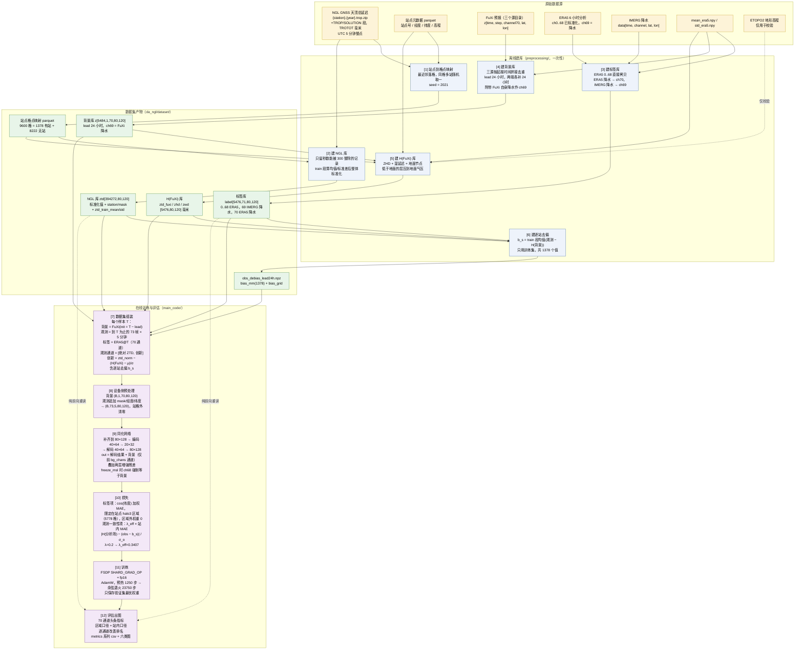
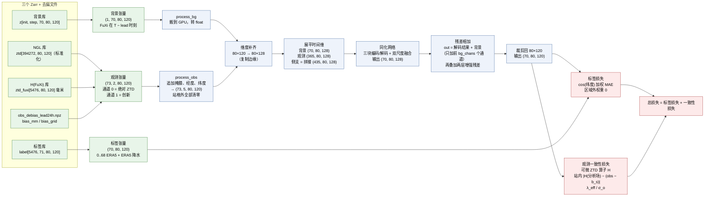
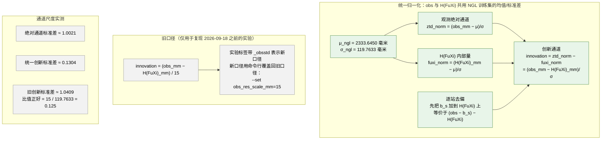

# da_ngl 数据流程图（中文）

> 与 [`DATA_PIPELINE.md`](DATA_PIPELINE.md) 配套；那份文档讲细节，这里给图。
> 生成时间：2026-09-18，对应当前 `configs.py` 默认口径。
>
> 三种呈现方式，按需取用：
> 1. **Mermaid**（下面三张图）—— GitHub / VS Code / Typora 等支持 Mermaid 的 Markdown 阅读器可直接渲染；
> 2. **Graphviz** —— [`data_pipeline.dot`](data_pipeline.dot)，`dot -Tpng data_pipeline.dot -o data_pipeline.png`；
> 3. **纯文本** —— `DATA_PIPELINE.md` 第 0 节的 ASCII 图。
>
> ⚠️ 字体：本机 `fc-list` 里 CJK 字体为 0，**在本机渲染 Graphviz 会显示成方块**；
> 请在有中文字体的机器上渲染，或把 `.dot` 里的 `fontname` 换成系统已有的中文字体
> （"Source Han Sans SC" / "Noto Sans CJK SC" / "WenQuanYi Zen Hei" / "Microsoft YaHei" / "PingFang SC"）。

---

## 1. 总体流程（离线建库 → 数据集产物 → 在线训练/评估）



---

## 2. 单个样本的数据流（形状与通道）



关键数字（当前配置）：

| 项 | 值 |
| --- | --- |
| 观测窗 | 73 帧 × 5 分钟 = 6 小时，结束于分析时刻 T |
| 观测通道 | 2（绝对 ZTD、创新）+ 掩膜 1 + 经度 1 + 纬度 1 = 5 |
| 背景通道 | 70（ERA5/FuXi 69 个状态量 + FuXi 自身降水） |
| 输出通道 | 70（69 个状态量 + 训练所用的降水） |
| 空间尺寸 | 输入 80×120 → 内部补齐 80×128 → 输出裁回 80×120 |
| 参数量 | 约 7370 万（embed_dim = 128，depth = (2,2,2)） |

---

## 3. 归一化与两条输入通道（2026-09-18 口径）



---

## 4. 口径与输出对照（评估阶段）

```mermaid
flowchart TB
    IN["训练好的权重<br/>{model_id}_{arch_tag}.pth"]
    DS["评估数据集<br/>读全部 71 个通道<br/>（两个降水都能拿到）"]
    TRUTH["真值 = 0..68 ERA5 + 训练所用的降水"]
    BG["背景 = 0..68 FuXi + FuXi 降水（若有）"]
    OUT["模型输出 70 通道"]

    IN --> OUT
    DS --> TRUTH
    DS --> BG

    M1["区域口径<br/>loss_region_mask = 站点 + halo3<br/>共 5778 格<br/>→ metrics_region.csv<br/>→ 头条指标 improve_pct_70ch_region"]
    M2["站内口径<br/>站点格 1378 个<br/>→ metrics_station.csv"]
    M3["全格口径<br/>loss_domain='full' 时是全部 9600 格<br/>当前默认只用训练区域<br/>→ metrics.csv（列名没有 _region 后缀，注意）"]
    M4["逐通道排名<br/>→ channels_70ch.csv<br/>→ metrics.json 里的 channels_improved / channels_worse"]

    TRUTH --> M1
    TRUTH --> M2
    TRUTH --> M3
    OUT --> M1
    BG --> M1
    OUT --> M2
    BG --> M2
    OUT --> M3
    BG --> M3
    M1 --> M4
    M2 --> M4

    NOTE["长期口径政策：<br/>1. 只用 station_halo，头条指标看区域；<br/>2. 一律看 70 通道；<br/>3. 必须逐通道说明哪些提升、哪些下降。"]
    M4 --> NOTE

    classDef io fill:#eef3fb,stroke:#4a6fa5,color:#000
    classDef metric fill:#fdeaea,stroke:#b04a4a,color:#000
    IN,DS,TRUTH,BG,OUT io
    class M1,M2,M3,M4,NOTE metric
```

---

## 5. 步骤与脚本对照表

| 步骤 | 脚本 | 输入 | 输出 |
| --- | --- | --- | --- |
| [1] 站点映射 | `test/map_stations_to_grid.py` | NGL 归档目录、站点元数据 | `ngl_europe_0p25_80x120_station_grid_map.parquet` |
| [2] NGL 库 | `preprocessing/build_ngl_zarr.py` | `*.trop.zip`、站点映射 | `ngl_europe_0p25_5min.zarr` |
| [3] 标签库 | `preprocessing/build_label_zarr.py` | ERA5、IMERG、mean/std | `label_europe_0p25.zarr`（71 通道） |
| [4] 背景库 | `preprocessing/build_fuxi_zarr.py` | 三个 FuXi 源 | `fuxi_europe_0p25_24h_70ch.zarr` |
| [5] H(FuXi) | `preprocessing/build_ztd_fuxi_zarr.py` | 背景库、站点高度 | `ztd_fuxi_europe_0p25_24h.zarr` |
| [6] 逐站去偏 | `preprocessing/build_obs_debias.py` | NGL 库、H(FuXi) 库、训练样本 | `obs_debias_lead24h.npz` |
| [7] 数据集 | `main_code/main/utils/utils_data.py` | 上面全部 | 样本三元组（背景、观测、标签） |
| [8] 设备侧预处理 | `main_code/train_FSDP.py` | 样本张量 | GPU 上的 `(B,1,70,80,120)` 与 `(B,73,5,80,120)` |
| [9] 网络 | `main_code/main/model/assimilation.py` | 背景、观测 | 分析场 `(B,1,70,80,120)` |
| [10] 损失 | `build_optimizer.py` + `ztd_torch.py` | 分析场、标签、观测 | 标签损失 + 观测一致性损失 |
| [11] 训练 | `main_code/train_FSDP.py` | DataLoader | val 最优权重、`summary.json`、loss 曲线 |
| [12] 评估出图 | `main_code/plot_results.py` | 权重、三个库 | `metrics*.csv`、`channels_70ch.csv`、`metrics.json`、六类图 |

校验与辅助脚本：

| 脚本 | 用途 |
| --- | --- |
| `preprocessing/check_ztd_operator.py` | numpy 版 ZTD 算子 vs NGL 实测（总延迟 RMSE 14.3 毫米，距平 RMSE 12.1 毫米） |
| `preprocessing/check_ztd_torch.py` | torch 版算子 vs 已建 store（最大差 0.0007 毫米）；冻结静力项时 msl 梯度为 0 |
| `test/linear_da_baseline.py` / `_6h.py` | 线性卡尔曼增益基线（站内 69 通道 +0.376%，是网络要追平的目标） |
| `test/plot_channel_improvement.py` | 把单个实验的逐通道改善画成图 |
