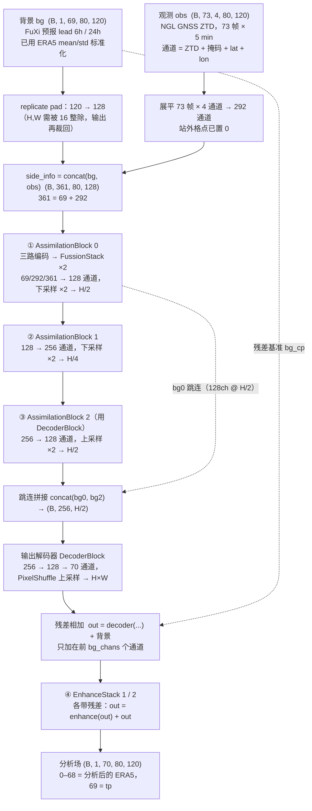
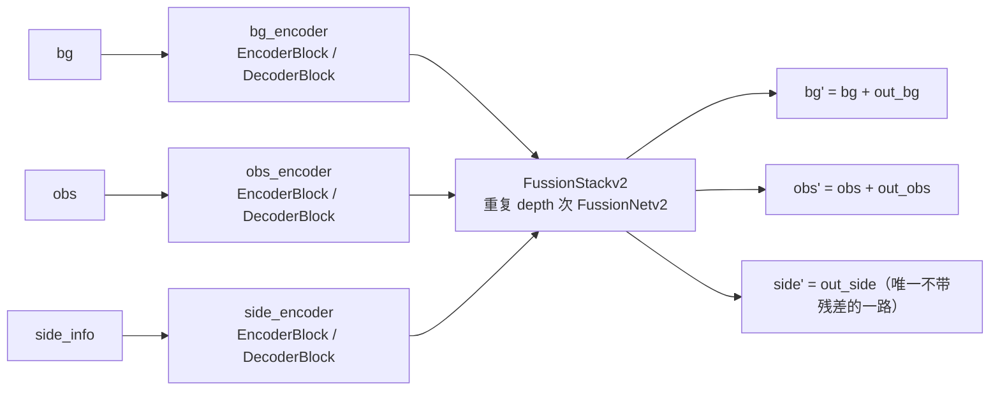
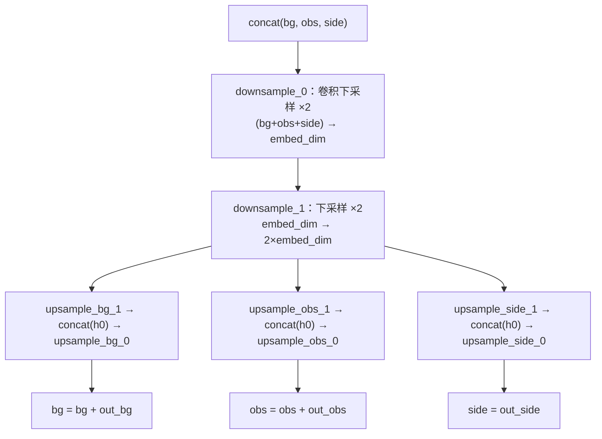
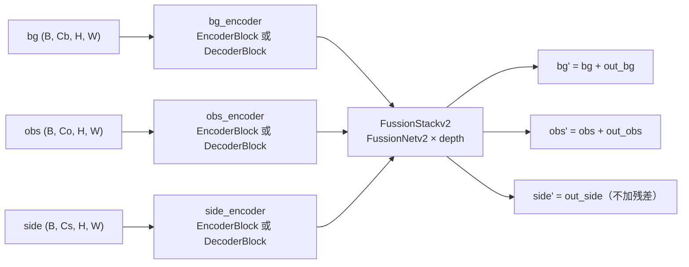
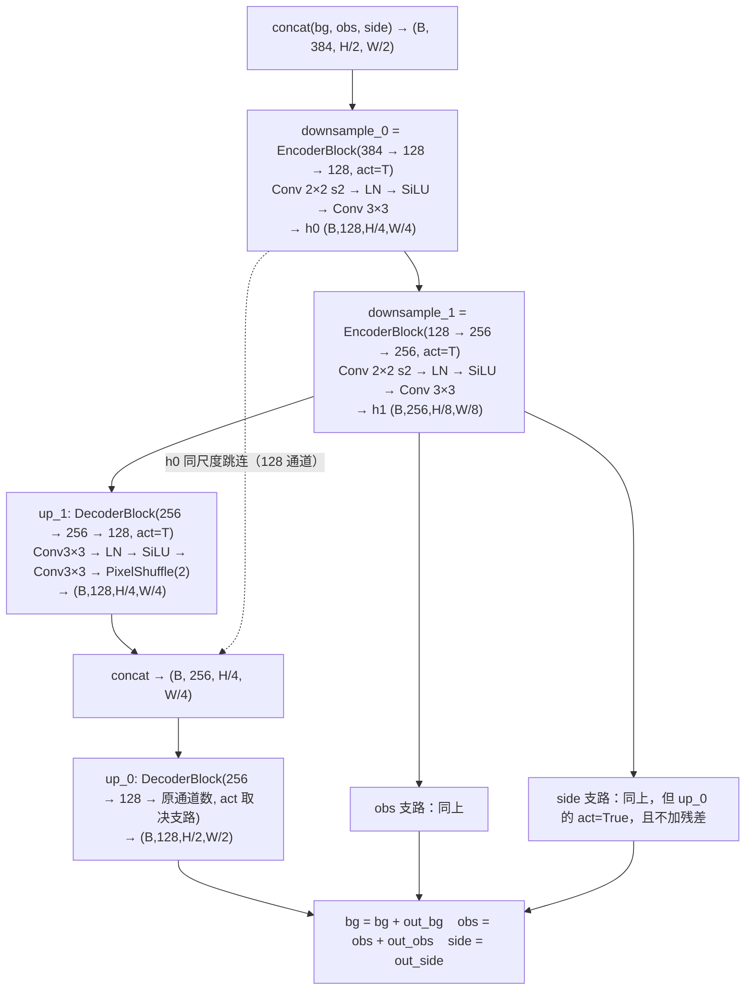

# AssimilationNetv6 结构图（中文）

> 图形文件：`model_arch.svg`（矢量图，中文由你本地字体渲染；浏览器 / Inkscape / Word 都能打开）
> 本文件是同一张图的 Mermaid 版 + 文字说明。

## 1. 整体数据流

## 2. AssimilationBlock 内部（① ② ③ 都是这个结构）

## 3. FussionNetv2 内部（融合单元）

## 4. 关键数字（当前配置）

| 项 | 值 |
| --- | --- |
| 背景通道 | 69（默认）／70（`include_fuxi_tp=true`，多一列 FuXi tp） |
| 观测张量 | 73 帧 × 4 通道（absolute）/ 5 通道（innovation）/ 6 通道（both），站外为 0 |
| 输出通道 | 70（0–68 ERA5 状态 + 69 tp） |
| 网格 | 80 × 120，训练时内部填充到 80 × 128（能被 16 整除），输出裁回 |
| embed_dim / depth | 128 / (2, 2, 2) |
| 参数量 | 约 73.7 M |
| 空间流程 | H×W → H/2 → H/4 → H/2 → H×W |
| 残差位置 | ① FussionNetv2 的 bg/obs 两路；② 输出端 `out = decoder + 背景`；③ EnhanceStack ×2 |
| 损失 | 纬度加权 MAE（70 通道；可选站点加权 `loss_station_weight` / `loss_nostation_weight`） |

## 5. 几个容易看错的地方

1. **背景既当输入、又当输出端的残差基准**：所以"分析 = 背景 + 网络修正"，
   网络的初始状态就是恒等映射（这也是为什么之前所有实验里 `分析 ≈ 背景`）。
2. **tp 通道默认没有背景**：残差相加只覆盖前 `bg_chans` 个通道，第 69 通道（tp）
   由解码器直接预测；开启 `include_fuxi_tp` 后 FuXi 的 tp 进入背景，残差才覆盖它
   （实测 tp MAE 0.31 → 0.237）。
3. **FussionNetv2 的 side 支路不加残差**，只有 bg / obs 两路是残差更新。
4. **观测不是逐帧分别编码的**：73 帧 × 4 通道先展平成 292 通道，再作为一整块送进
   `obs_encoder`（时间信息完全交给卷积在这 292 个通道里自己组合）。

---

# 附：AssimilationBlock 与 FussionNetv2 逐层展开

> 对应的矢量图：`model_arch_blocks.svg`（同样全中文）

## A. AssimilationBlockv2

三个 stage 的编码器/融合配置（当前 `embed_dim=128, depth=(2,2,2)`）：

| stage | 编码器类型 | 编码器形状 | 融合输入→输出 | 融合内部宽度 | 空间 |
| --- | --- | --- | --- | --- | --- |
| ① block_0 | EncoderBlock | 69/292/361 → 128 → 128 | 128/128/128 → 同 | 128 / 256 | H → H/2 |
| ② block_1 | EncoderBlock | 128 → 256 → 256 | 256/256/256 → 同 | 128 / 256 | H/2 → H/4 |
| ③ block_2 | DecoderBlock | 256 → 256 → 128 | 128/128/128 → 同 | 128 / 256 | H/4 → H/2 |

注意 stage ② 的融合内部仍然是 128 宽（`FussionNetv2` 的 `embed_dim` 固定为 128），
只有进出两端的通道数是 256——所以 `downsample_0` 的输入是 3×256=768 通道，输出 128。

## B. FussionNetv2 内部（以 stage 0 为例，三路各 128 通道 @ H/2）

三条支路的差别（代码里唯一的不对称）：

| 支路 | `up_0` 的 `act` | 输出处理 | 原因 |
| --- | --- | --- | --- |
| bg | `False`（线性输出） | `bg = bg + out_bg` | 输出是残差修正量 |
| obs | `False` | `obs = obs + out_obs` | 同上 |
| side | `True`（多一层 LN+SiLU） | `side = out_side` | 直接替换，不是残差 |

## C. 四个基本积木的逐层定义

| 积木 | 层（`nn.Sequential` 顺序） | 空间 |
| --- | --- | --- |
| `EncoderBlock(in, embed, out, k=3, act)` | `Conv2d(in→embed, k=2, s=2, p=0)` → `ln_norm(embed, 1e-6)` → `SiLU` → `Conv2d(embed→out, k=3, p=1)` → `act ? ln_norm(out,1e-6)+SiLU` | ÷2 |
| `DecoderBlock(in, embed, out, k=3, act)` | `Conv2d(in→embed, k=3, p=1)` → `ln_norm(embed,1e-6)` → `SiLU` → `Conv2d(embed→out×4, k=3, p=1)` → `PixelShuffle(2)` → `act ? ln_norm(out,1e-6)+SiLU` | ×2 |
| `ln_norm(C, eps=1e-5)` | `permute(NCHW→NHWC)` → `LayerNorm(C)` → `permute` 回 | 不变 |
| `EnhanceStack(in, e)` | `EncoderBlock(in→e→e)` → `EncoderBlock(e→2e→2e)` → `DecoderBlock(2e→2e→e)` → `concat(x0, ·)` → `DecoderBlock(2e→e→in, act=False)`；调用处再 `out = enhance(out) + out` | 先 ÷2 再 ×2 |

容易看漏的三点：

1. **下采样用的是 2×2、stride 2、padding 0 的"patch 卷积"**，不是常见的 3×3 stride 2；3×3 那层是保持分辨率做特征变换。
2. **升采样用 `PixelShuffle(2)`**（先卷积出 `out×4` 通道再重排），不是转置卷积或插值。
3. **`ln_norm` 只沿通道维做 LayerNorm**，没有 BN 的 running stats，所以训练/推理完全一致——这也是我之前排查"训练与推理不一致"时排除掉的一环。
