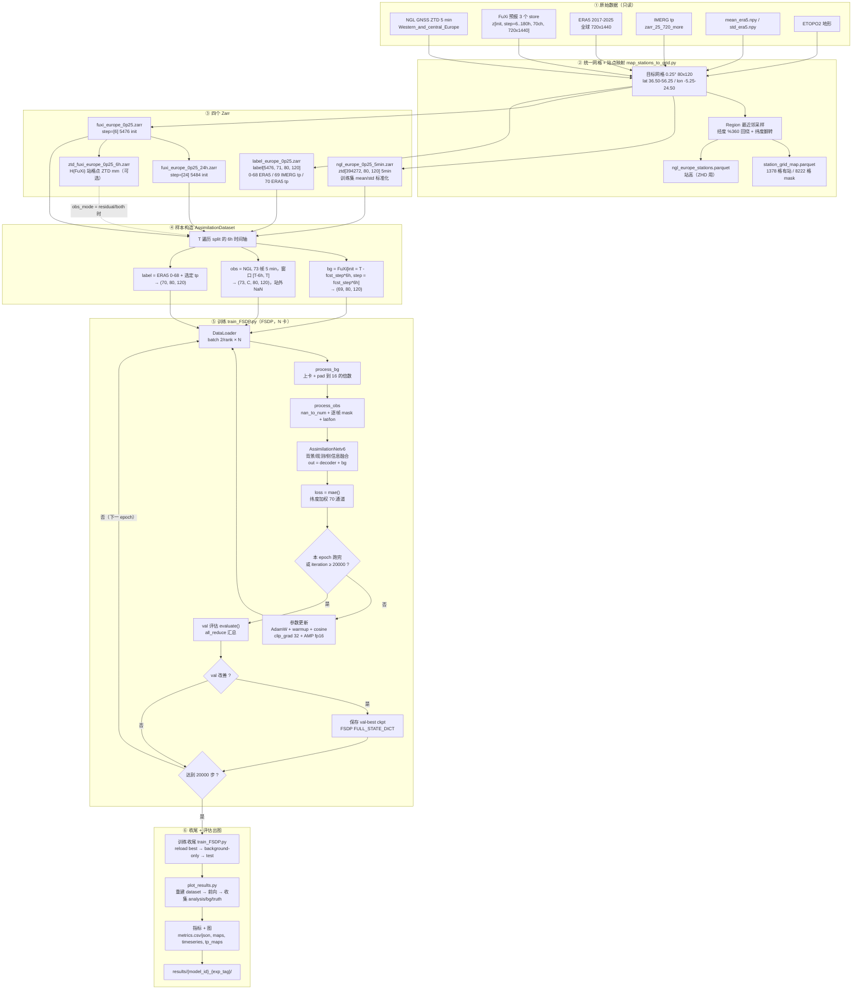

# da_ngl 训练全流程（GNSS ZTD + FuXi → ERA5 同化）

> 同目录下的产物：
> - `pipeline_flowchart.png` —— 整张流程图的位图，**英文版**（这台机器只有 DejaVu 字体，没有中文字体，中文会渲染成方框）
> - `pipeline_flowchart.dot` —— Graphviz 源文件，在有 graphviz 的机器上 `dot -Tpng pipeline_flowchart.dot -o x.png` 可重新出图
> - 本文件 —— 中文详细说明 + Mermaid 版流程图（Mermaid 由阅读器渲染，不依赖中文字体）

---

## 0. 一句话概括

原始数据 → 统一 0.25° 网格上的四个 Zarr → 以「分析时刻 T」为单位的样本 → FSDP 多卡训练一个残差网络
（`out = decoder(...) + FuXi 背景`）→ 训练结束自动评估出图。观测（GNSS ZTD）只通过输入通道进入网络。

---

## 1. 总览流程图（Mermaid）



---

## 2. 阶段详解

### 2.1 ① 原始数据（只读）

| 来源 | 路径 | 说明 |
| --- | --- | --- |
| NGL GNSS ZTD | `ngl_ztd_all_downloaded/data/top10_2022_2026/Western_and_central_Europe` | 5 分钟采样 |
| FuXi 预报 | `huangyuanqing/data/Fuxi_pred_2017_2024`、`FuXi_Pred_2024_2025`、`FuXi_Pred_2025_other` | `z[init, step, 70ch, 720, 1440]`，step = 6…180 h，init 每 6 h 一条 |
| ERA5 | `huangyuanqing/data/ERA5_2017_2025` | 全球 720×1440 |
| IMERG tp | `database/fuxi-obs/imerg/zarr_25_720_more` | 降水标签来源 |
| 标准化统计量 | `database/fuxi-obs/obs-grid_qc/mean_std` | `mean_era5.npy` / `std_era5.npy`，FuXi 与 ERA5 共用 |
| 地形 | `xuxiaoze/shape/ETOPO2v2c_f4.nc` | 算 ZHD 要用站高，地形只是兜底/对照 |

### 2.2 ② 统一网格与站点映射（`preprocessing/map_stations_to_grid.py`）

- 目标网格：0.25°，**80 × 120**，lat 36.50–56.25，lon −5.25–24.50
- 所有源场用 `common.Region` 做**最近邻**采样：经度 **`% 360` 回绕**（−5.25 → 354.75），纬度轴翻转
- 站点→格点：一格雷，多站随机取一个（seed=2021），**1378 格有站，8222 格被 mask**
- `ngl_europe_stations.parquet` 提供站高（ZTD 算子的 ZHD 项需要，用 ETOPO2 替代会让 RMSE 从 14.3 mm 劣化到 80 mm）

### 2.3 ③ 四个 Zarr（`preprocessing/build_*.py`，新增 store 必须调 `common.finalize_store`）

| store | 形状 / 内容 | 备注 |
| --- | --- | --- |
| `ngl_europe_0p25_5min.zarr` | `ztd[394272, 80, 120]`，5 分钟 | 用**训练集全局** mean/std 标准化（2333.645 / 119.763 mm），站外 NaN，带 `mask`/`station` |
| `fuxi_europe_0p25.zarr` | `z[5476, step=[6], 69, 80, 120]` | lead 6 h；值已是 ERA5 mean/std 标准化 |
| `fuxi_europe_0p25_24h.zarr` | `z[5484, step=[24], 69, 80, 120]` | lead 24 h；`--init-pad-hours 24` 让 init 从 2021-12-31 00:00 起，**保证 6 h 与 24 h 两个版本的样本集完全一致** |
| `ztd_fuxi_europe_0p25_6h.zarr` | `ztd_fuxi[5476, 80, 120]`（站格点，mm）+ `zhd` / `zwd` | 用 `ztd_operator.py` 把 FuXi 场过一遍观测算子；**只有 `obs_mode ∈ {residual, both}` 才需要**，且必须与背景的 lead 对应 |
| `label_europe_0p25.zarr` | `label[5476, 71, 80, 120]` | 0–68 ERA5，69 IMERG tp，70 ERA5 tp；tp 做 `clip(0) → log1p → z-score`；训练只读前 70 通道 |

时间轴统一：2022-01-01 → 2025-10-01（半开），6 小时一条；split 只写在 attrs 里。

### 2.4 ④ 样本构造（`main_code/main/utils/utils_data.py`）

一个样本 = 一个分析时刻 `T`：

```
背景 bg    = FuXi[init = T − fcst_step×6h,  step = fcst_step×6h]      (69, 80, 120)
观测 obs   = NGL 连续 obs_frames = 73 帧（5 min），窗口 [T−6h, T]      (73, C, 80, 120)
标签 label = ERA5 0–68 + 选中的 tp（tp_label_source）                 (70, 80, 120)
```

- `fcst_step = 1` → lead 6 h；`fcst_step = 4` → lead 24 h（**按数值在 store 的 step 轴上定位，不是硬编码索引**）
- 两端缺背景 / 标签 / 观测的样本自动跳过
- 划分：train `2022-01-01 → 2024-05-01`（3403）· val `→ 2025-01-01`（980）· test `→ 2025-10-01`（1092）
- `obs_mode`：`absolute`（1 通道绝对 ZTD）/ `residual`（1 通道 `obs − H(bg)`）/ `both`（2 通道）

### 2.5 ⑤ 训练循环（`main_code/train_FSDP.py`）

| 环节 | 细节 |
| --- | --- |
| 启动 | `train.sh` → `mp.spawn`，`world_size = torch.cuda.device_count()`，FSDP + `SHARD_GRAD_OP` |
| 前处理 | `process_bg`：上卡、H/W replicate-pad 到 16 的倍数（120→128）、输出裁回；`process_obs`：`nan_to_num`、逐帧 mask、拼 mask+lat/lon、整块乘 mask（站外 0） |
| 模型 | `AssimilationNetv6`：三路 encoder → `FussionStackv2` → `EnhanceStack` → decoder；**残差只加在前 69 通道**，tp 直接预测；`embed_dim=128`、`depth=(2,2,2)`、~73.7 M 参数 |
| 损失 | `mae()`：纬度加权（cos lat 归一）、NaN-safe；**70 通道一起算**；目前**没有站点掩码**（有站格点只占加权损失的 14%，无站格点占 86%） |
| 优化 | AdamW（lr 1e-4，wd 0.1）、warmup 1000 步（1e-8→1e-4）→ CosineAnnealing（T_max=19000）、`clip_grad_norm_(32)`、AMP fp16 |
| 迭代 | 总步数 `num_iteration = 20000`，batch 2/卡；每 100 步写一行日志（仅 rank 0） |
| 选模型 | 每个 epoch 结束在 val 上评估（70 通道 loss，`all_reduce`），**只有变好（`min_delta=0`）才存**，FSDP `FULL_STATE_DICT`，rank 0 写盘 |
| 收尾 | reload val-best → 评估 background-only（train/val，69 通道）→ test（model 70 ch vs background 69 ch）→ 写 `summary.json` |

### 2.6 ⑥ 评估与出图（`plot_results.py`，`train.sh` 训练后自动串联，单卡）

用同一份 config + tag 重建 dataset → 载入 val-best ckpt → 逐样本前向，收集 analysis / background / truth(71 ch)：

- 指标：69 通道与 70 通道 MAE、气候态、逐通道 `metrics.csv`、`improve_pct`、优于背景的通道数、平均改动幅度（`mean |analysis − bg|`）
- 图：`loss_curve.png`、`channel_metrics.png`、`maps_{z500,t850,r700,t2m,msl}.png`、`timeseries(_tp).png`、`tp_maps.png`
- 输出目录：`work_dir/results/{model_id}_{exp_tag}/`

---

## 3. 目录 / tag / 日志约定

```
main_code/work_dir/results/{model_id}_{exp_tag}/
    {model_id}_{arch_tag}.pth       只保留 val 最好的那个
    summary.json                    最佳 val / 逐 epoch loss / 背景-only / test
    train_loss.npy val_loss.npy lr.npy
    loss_curve.png channel_metrics.png maps_*.png timeseries*.png tp_maps.png
    metrics.csv metrics.json

da_ngl/logs/{model_id}_{arch_tag}.log     训练进度（每 100 步一行）
```

- `exp_tag` = `lead{fcst_step*6}h_obs{obs_frames*5//60}h_{tp_label_source}tp`，非 `absolute` 再加 `_{obs_mode}`，`zero_obs=True` 再加 `_zeroobs`
- `arch_tag` = `ed{model_embed_dim}_d{depth}`
- **日志分两处**：`nohup ... > xxx.log` 那个重定向文件只会有裸 `print`（如 `[Dataset] ...`）和 warning；logger 的 stdout handler 被压到 WARNING，INFO 进度只进 `da_ngl/logs/` 下的文件

---

## 4. 常用命令

```bash
# 环境
conda activate gnss
cd /cpfs01/projects-HDD/cfff-4a8d9af84f66_HDD/public/linan/linan_dev/gnss/da_ngl

# 重建 FuXi store（lead 24 h）
python preprocessing/build_fuxi_zarr.py --leads 24 --init-pad-hours 24 --workers 40 \
       --output dataset/fuxi_europe_0p25_24h.zarr --force

# 训练（3 卡）+ 自动评估出图
cd main_code
CUDA_VISIBLE_DEVICES=0,1,2 MASTER_PORT=22336 nohup bash train.sh \
    --model_id lead24 \
    --set fuxi_zarr=/cpfs01/.../da_ngl/dataset/fuxi_europe_0p25_24h.zarr \
    --set fcst_step=4 > /dev/null 2>&1 &

# 进度
tail -f ../logs/lead24_ed128_d222.log

# 单独评估某次实验
CUDA_VISIBLE_DEVICES=0 python plot_results.py --split test --model_id lead24 \
    --set fuxi_zarr=.../fuxi_europe_0p25_24h.zarr --set fcst_step=4
```

---

## 5. 容易踩的坑（都在 HANDOFF 里记过，这里对流程位置）

| 位置 | 坑 |
| --- | --- |
| 数据构建 | 新 store 必须调 `finalize_store`，否则 xarray 会把 `time==0` / `lon==0` / `mask==False` 当成 NaN |
| 坐标 | 源数据经度是 0–360，用 `sel(lon=-5.25, method='nearest')` 会落到 **0°E**；正确点是 `(-5.25) % 360 = 354.75` |
| 时间轴 | 加 `--init-pad-hours` 后 init 轴会早于 `TIME_START`，这是有意的（保证 lead 24 h 的样本集和 lead 6 h 一致）；`init` 存的是相对 2022-01-01 的小时数，可能是负数 |
| 模型 | H/W 必须能被 16 整除，120 会 pad 到 128 再裁回 |
| 损失 | 先 `nan_to_num` 再作差，否则 `NaN×0=NaN` |
| 多卡 | 收尾评估不能写在 `if rank==0` 里（`all_reduce` 死锁）；checkpoint 必须用 FSDP 的 `FULL_STATE_DICT` API |
| 启动 | `nohup` 不能跟 `VAR=val` 前缀，要写成 `VAR=val nohup bash ...` |
| 对比 | 训练日志里的 `Test model=... background=...` 不可比（前者含 tp）；要看得看 `plot_results.py` 的 69 通道口径 |
| 选模型 | val-best 是按**含 tp 的 70 通道 loss** 选的，和 69 通道指标的取向不完全一致 |
